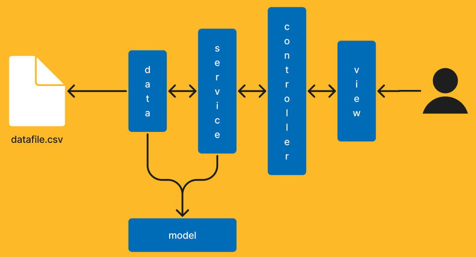

# Arquitetura

Abaixo podemos ver um desenho de como funciona a arquitetura da solução em camadas.

> OBS.: Por ser um problema relativamente simples a ser resolvido não acredito que uma arquitetura tão rebuscada. Contudo, como um dos requisitos de avaliação do desafio é **arquitetura**, resolvi montar a solução abaixo

## Camadas

1. **View** - Essa camada é responsável pela interface gráfica e é por ela que o usuário tem acesso direto ao sistema.

2. **Controller** - Essa é a camada que processa os pedidos feitos pelo usuário através da camada _view_ e se conecta ao _núcleo_ da aplicação (com as regras de negócio) passando esse pedido para a camada seguinte que saberá como executar o que foi requisitado.

3. **Service** - Esta camada contém a lógica de negócio propriamente dita e consegue se comunicar com a camada de dados (_data_) e com a camada _model_.

4. **Data** - Esta camada é a responsável por fornecer os dados para a aplicação (que estão no arquivo `restaurants-hours.csv`).

5. **Model** - Esta camada contém as entidades de domínio da aplicação.